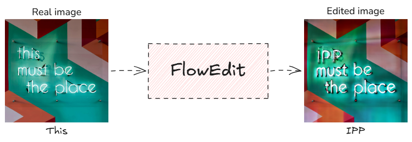

# FlowEdit Implementation

## Overview

This is an implementation of **FlowEdit**, a T2I editing technique based on flow-matching diffusion models. FlowEdit enables precise image-to-image transformations using Stable Diffusion 3, allowing you to edit images by simply providing source and target text prompts.



## Installation

1. Clone this repository:

```bash
git clone https://github.com/Jalalbaim/FlowEdit-implementation.git
cd FlowEdit-implementation
```

2. Create and activate a virtual environment:

3. Install dependencies:

```bash
pip install torch torchvision diffusers transformers pillow numpy pyyaml
```

4. Edit images using the main script:

```bash
python my_FlowEdit.py --input_img example_images/bear.png --source_prompt "A large brown bear" --target_prompt "A large panda bear" --output_dir my_outputs/bear_edit
```

### Key Parameters

- `--T`: Number of diffusion timesteps (default: 50)
- `--n_avg`: Number of averaging steps for smoothing (default: 1)
- `--n_min`: Minimum timestep for editing (default: 0)
- `--n_max`: Maximum timestep for editing (default: 33)
- `--cfg_src`: Classifier-free guidance scale for source (default: 3.5)
- `--cfg_tar`: Classifier-free guidance scale for target (default: 13.5)

```
FlowEdit-implementation/
├── my_FlowEdit.py              # Main FlowEdit implementation
├── edits.yaml                  # Configuration for batch editing
├── example_images/             # Sample input images
├── my_outputs/                 # Generated edited images
├── Figure7_reproduction/       # Scripts to reproduce paper results
└── Original Implementation/    # My own implementation
```
